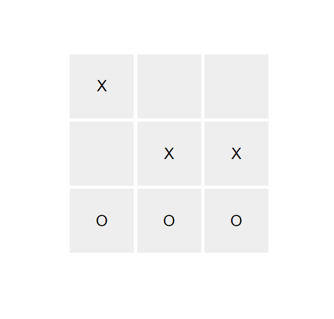

# Projet de Jeu de Morpion (Tic-Tac-Toe)

## Description

Ce projet est un jeu de morpion (tic-tac-toe) à deux joueurs, développé avec Node.js et utilisant la bibliothèque Ramda pour les opérations fonctionnelles. Le jeu comporte une interface graphique simple construite avec HTML, CSS et JavaScript, et utilise Socket.io pour la communication en temps réel entre le serveur et les clients.

## Fonctionnalités

- Jeu de morpion à deux joueurs en temps réel
- Interface utilisateur simple et intuitive
- Gestion des états du jeu avec Ramda
- Communication en temps réel avec Socket.io
- Notification de victoire ou de match nul
Le jeu se lance sur une page internet en local à l'adresse suivante: http://localhost:3000/

## Prérequis

- Node.js (version 12 ou supérieure)

## Utilisation

1. Démarrez le serveur Node.js:

    ```sh
    node server.js
    ```

2. Ouvrez votre navigateur web et accédez à l'adresse suivante:

    ```
    http://localhost:3000
    ```

3. Jouez au jeu de morpion avec un ami!

## Structure du Projet

Le projet est organisé comme suit:

- `public/` : Contient les fichiers statiques pour l'interface utilisateur.
  - `index.html` : La page HTML principale avec le jeu de morpion.
- `server.js` : Le fichier principal du serveur Node.js, gérant les connexions Socket.io et la logique du jeu.
- `package.json` : Fichier de configuration de npm, listant les dépendances du projet.
- `README.md` : Ce fichier README avec les instructions et informations sur le projet.

## Bibliothèques et Outils Utilisés

- [Node.js](https://nodejs.org/) : Environnement d'exécution JavaScript côté serveur
- [Express](https://expressjs.com/) : Framework web pour Node.js
- [Ramda](https://ramdajs.com/) : Bibliothèque JavaScript pour la programmation fonctionnelle
- [Socket.io](https://socket.io/) : Bibliothèque pour la communication en temps réel


## Auteurs

- **Virgile Louvel** - *Développeur principal* -

---

Merci d'avoir utilisé ce projet! Amusez-vous bien en jouant au morpion!

Voici un apercu du jeu :

<div style="text-align: center;">
    
</div>
